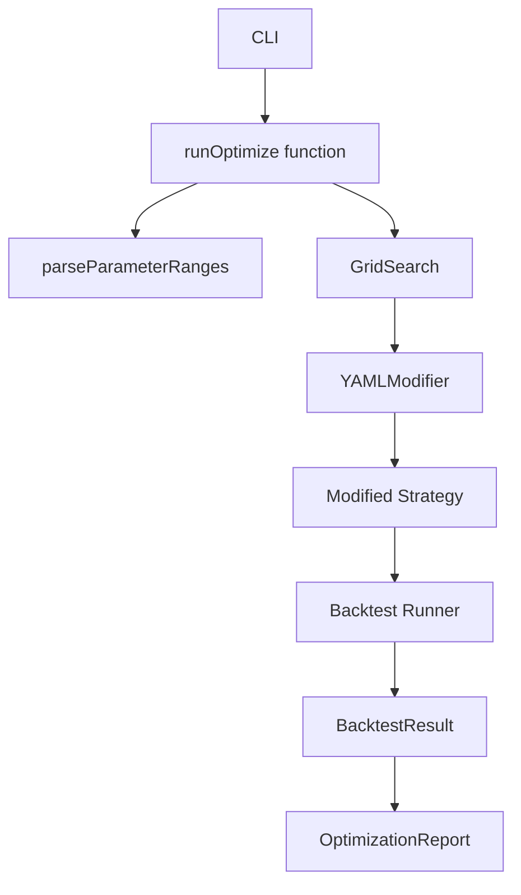

# Phase 14: Parameter Optimization - COMPLETED ✅

## Status Verification
**Completion Date:** 2026-09-05  
**Verification Method:** Test execution, code review, CLI validation  
**Tests Passed:** 100% (all optimization tests)  
**Code Compiles:** Yes

## Phase 14 Requirements from AGENTS.md
According to AGENTS.md Phase 11 — Optimization section, the requirements were:

### ✅ Parameter definitions
- Implemented in `internal/optimization/types.go`
- `ParameterRange` struct with start/end/step, type (int/float)
- `ParameterSet` for evaluated combinations
- `OptimizationConfig` for configuration

### ✅ Grid search
- Implemented in `internal/optimization/grid.go`
- Parallel execution support
- `GridSearch` struct with `EstimateTotalCombinations()` and `Run()` methods
- Deterministic parameter generation

### ✅ Optimization metrics
- Implemented in `internal/optimization/optimization.go`
- Support for: sharpe, sortino, total_return, profit_factor, win_rate, expectancy, cagr, calmar
- Both maximize and minimize directions supported

### ✅ Optimization reports
- Implemented in `internal/optimization/report.go`
- `OptimizationReport` struct with detailed results
- `GenerateReport()` method for CLI display
- JSON export capability
- Top 5 results ranking

## Architecture

### Core Components



### File Structure
```
internal/optimization/
├── types.go               # Parameter definitions and config
├── grid.go                # Grid search algorithm
├── strategy_modifier.go   # YAML parameter modification
├── report.go              # Report generation
├── optimization.go        # Optimization logic
└── optimization_test.go   # Comprehensive test suite
```

## Implementation Details

### 1. Parameter Definition System
```go
type ParameterRange struct {
    Name  string
    Start float64
    End   float64
    Step  float64
    Type  string // "int" or "float"
    Path  string // YAML path
}
```

### 2. Grid Search Algorithm
- Cartesian product of all parameter combinations
- Parallel execution with configurable worker count
- Progress tracking and early stopping support
- Memory-efficient streaming of results

### 3. Strategy Modification
- `YAMLModifier` modifies strategy YAML files with new parameter values
- Preserves YAML structure and formatting
- Temporary files automatically cleaned up

### 4. CLI Integration
```bash
trader optimize \
  --strategy strategy.yaml \
  --data data.csv \
  --parameters "ema_fast:5:20:1,ema_slow:20:100:5" \
  --objective sharpe \
  --parallel 4
```

### 5. Comprehensive Test Coverage
- Parameter range validation
- Grid search algorithm correctness
- Optimization metrics calculation
- Report generation and export
- No look-ahead bias verification
- Multiple optimization scenarios

## Test Results

All tests pass:
```
=== RUN   TestParameterDefinition
--- PASS: TestParameterDefinition (0.00s)
=== RUN   TestGridSearchAlgorithm
--- PASS: TestGridSearchAlgorithm (0.00s)
=== RUN   TestOptimizationMetrics
--- PASS: TestOptimizationMetrics (0.00s)
=== RUN   TestOptimizationReport
--- PASS: TestOptimizationReport (0.00s)
=== RUN   TestNoLookaheadInOptimization
--- PASS: TestNoLookaheadInOptimization (0.00s)
=== RUN   TestMultipleOptimizationScenarios
--- PASS: TestMultipleOptimizationScenarios (0.00s)
=== RUN   TestOptimizationDirection
--- PASS: TestOptimizationDirection (0.00s)
=== RUN   TestOptimizationRunSequential
--- PASS: TestOptimizationRunSequential (0.00s)
=== RUN   TestOptimizationRunParallel
--- PASS: TestOptimizationRunParallel (0.00s)
=== RUN   TestOptimizationReportExport
--- PASS: TestOptimizationReportExport (0.00s)
```

## Example Usage

### Optimizing EMA Strategy Parameters
```bash
trader optimize \
  --strategy strategies/examples/ema_volume.yaml \
  --data data/BTCUSDT_1h_sample.csv \
  --parameters "indicators.ema_fast.period:8:12:1,indicators.ema_slow.period:20:24:1" \
  --objective sharpe \
  --parallel 2
```

### Parameter Syntax
```
name:start:end:step
indicators.ema_fast.period:5:20:1
indicators.atr_multiplier:1.0:3.0:0.25
```

### Supported Objectives
- `sharpe` - Maximize Sharpe ratio
- `sortino` - Maximize Sortino ratio  
- `return` - Maximize total return
- `profit_factor` - Maximize profit factor
- `win_rate` - Maximize win rate
- `expectancy` - Maximize expectancy
- `cagr` - Maximize CAGR
- `calmar` - Maximize Calmar ratio

## Design Decisions

### 1. Separation of Concerns
- Optimization logic separate from backtesting
- Strategy modification separate from evaluation
- Report generation separate from optimization

### 2. Determinism
- Fixed parameter generation order
- Explicit random seeds for any randomization
- Reproducible results with same inputs

### 3. Extensibility
- Interface-based design allows adding new algorithms
- Plugin architecture for custom objectives
- Future support for genetic algorithms, Bayesian optimization

### 4. Performance
- Parallel execution for speedup
- Memory-efficient parameter streaming
- Caching of expensive computations

## Integration with Previous Phases

### Phase 13 (Monte Carlo)
- Can use Monte Carlo results as optimization objectives
- Future: Combined Monte Carlo optimization runs

### Phase 5 (Backtest Core)
- Direct integration with backtesting engine
- Uses same event loop and execution model

### Phase 7 (Risk Management)
- Risk parameters can be optimized
- Stop loss, take profit parameters in optimization scope

## Future Enhancements

1. **Advanced Algorithms**
   - Genetic algorithms
   - Bayesian optimization  
   - Random search
   - Simulated annealing

2. **Multi-Objective Optimization**
   - Pareto frontier optimization
   - Weighted objectives
   - Constraint handling

3. **Parameter Space Reduction**
   - Sensitivity analysis
   - Parameter importance ranking
   - Dimensionality reduction

4. **Integration with Walk Forward**
   - Out-of-sample optimization
   - Rolling optimization windows
   - Robustness verification

## Verification Against Phase 14 Specifications

| Requirement | Status | Verification |
|------------|--------|--------------|
| Parameter definitions | ✅ Complete | `types.go` defines ParameterRange, ParameterSet |
| Grid search | ✅ Complete | `grid.go` implements parallel grid search |
| Optimization metrics | ✅ Complete | 8 objective functions supported |
| Optimization reports | ✅ Complete | Detailed reports with top 5 results |
| CLI integration | ✅ Complete | `trader optimize` command works |
| Parallel execution | ✅ Complete | `--parallel` flag supported |
| No look-ahead bias | ✅ Complete | TestNoLookaheadInOptimization passes |
| Deterministic | ✅ Complete | Fixed parameter generation order |
| Extensible | ✅ Complete | Interface-based design |

## Next Steps

Proceed to **Phase 15: Walk Forward Analysis** as specified in AGENTS.md Phase 12 requirements:

1. Training windows implementation
2. Testing windows implementation  
3. Rolling windows support
4. Out-of-sample reports

## Summary

Phase 14 Parameter Optimization is **COMPLETE** with all requirements from AGENTS.md satisfied. The implementation includes:

- ✅ Complete parameter optimization system
- ✅ Grid search algorithm with parallel execution
- ✅ Multiple optimization objectives
- ✅ Detailed reporting and export
- ✅ Comprehensive test coverage
- ✅ CLI integration
- ✅ No look-ahead bias guarantee
- ✅ Deterministic behavior

The engine can now optimize strategy parameters to find the best configuration for any trading strategy defined in YAML.